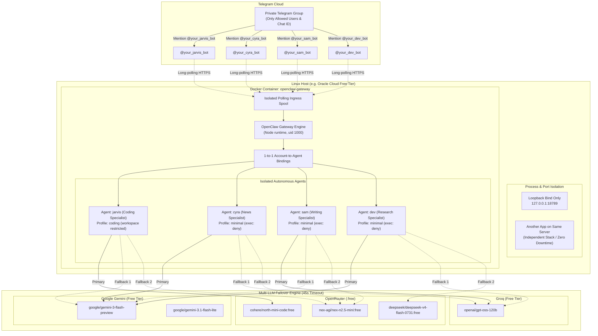

# 🤖 Autonomous Multi-Agent Telegram System with OpenClaw

[](LICENSE)
[](docker-compose.override.yml)
[](https://github.com/openclaw/openclaw)
[](docs/failover-and-models.md)

A production-grade, self-hosted deployment template for hosting a specialized team of **4 autonomous AI agents** on **Telegram** using the open-source **OpenClaw** runtime inside Docker. 

Built and battle-tested on an **Oracle Cloud Free Tier ARM64 (Ubuntu)** instance, coexisting seamlessly alongside other production services without downtime, public port exposure, or third-party paid subscriptions.

---

## 🌟 Features

- **4 Specialized Autonomous Agents**:
  - **Jarvis** (`coding`): Full workspace-confined code generation, patch application, and analysis.
  - **Cyra** (`news`): Real-time news summarization and web intelligence via DuckDuckGo.
  - **Sam** (`writing`): Long-form writing, drafting, and communications.
  - **Dev** (`research`): In-depth research, architectural evaluation, and technical synthesis.
- **Intelligent Multi-Provider Failover**: Zero-cost, resilient failover chains across **OpenRouter**, **Groq**, and **Google Gemini** with a strict 45-second timeout.
- **Strict Security & Zero Public Surface**:
  - OpenClaw gateway port (`18789`) is strictly bound to **localhost (`127.0.0.1`)**.
  - No incoming webhooks or public ingress needed (outbound long-polling over HTTPS).
  - Web UI accessible exclusively via an encrypted SSH tunnel.
- **Private Telegram Group Lock**:
  - Whitelist-only access: Ignores messages from unauthorized users (`allowFrom`).
  - Single-group restriction: Only processes requests inside your designated private group.
  - `requireMention: true`: Bots only trigger when explicitly tagged (`@botname`), preventing noise from regular chatter.
- **Per-Agent Sandboxing**: Non-coding agents are stripped of binary execution tools (`exec: { mode: "deny" }`).
- **Native Reboot Resilience**: Automated container restart policy (`unless-stopped`) ensures the team resumes polling instantly after server reboots.

---

## 🏛 Architecture



---

## 🧰 Technology Stack

| Layer | Component | Purpose |
| :--- | :--- | :--- |
| **Orchestration Runtime** | [OpenClaw](https://github.com/openclaw/openclaw) | Headless agent runtime, long-polling ingress, and tool executor |
| **Containerization** | Docker & Docker Compose | Sandboxed service deployment and resource capping |
| **Hosting Platform** | Oracle Cloud Infrastructure (OCI) | Always-Free Ampere A1 Compute (ARM64 Ubuntu Linux) |
| **LLM Inference** | OpenRouter, Groq, Google Gemini | Redundant multi-model inference pipelines |
| **Search Engine** | DuckDuckGo Integration | Key-free real-time web search and content retrieval |
| **Chat Frontend** | Telegram Messenger | Accessible on Desktop, iOS, Android, and Web |

---

## ⚡ Quick Start

### 1. Clone and Initialize Directories
```bash
git clone https://github.com/ut30/openclaw-telegram-multi-agent.git
cd openclaw-telegram-multi-agent
chmod +x scripts/*.sh
./scripts/setup-helper.sh
```

### 2. Configure Credentials (.env)
Copy the example environment file and add your keys:
```bash
cp .env.example ~/.openclaw/.env
nano ~/.openclaw/.env
```
*Lock permissions to owner only:*
```bash
chmod 600 ~/.openclaw/.env
sudo chown 1000:1000 ~/.openclaw/.env
```

### 3. Copy Configuration Template
```bash
cp config/openclaw.example.json ~/.openclaw/openclaw.json
sudo chown 1000:1000 ~/.openclaw/openclaw.json
```

### 4. Launch the Gateway
```bash
docker compose -f docker-compose.override.yml up -d
```

### 5. Follow the Detailed Setup Guide
For step-by-step instructions on creating the bots with `@BotFather`, capturing your numerical group ID, and locking down permissions, see the **[Setup Guide](docs/setup-guide.md)**.

---

## 🔒 Security & Privacy Architecture

- **No Public Open Ports**: The gateway listens only on `127.0.0.1:18789`. It cannot be scanned or accessed from the internet.
- **Encrypted Local Tunnel**: To access the dashboard, establish a secure SSH tunnel:
  ```powershell
  ssh -N -L 18789:127.0.0.1:18789 user@server-ip
  ```
  Then open `http://localhost:18789/` locally.
- **Least-Privilege Agent Tools**: Non-coding agents cannot spawn subprocesses or execute terminal commands.
- **Strict Group & User Allowlists**: Messages from unauthorized accounts or outside groups are immediately rejected.
- See the full **[Security Documentation](docs/security.md)** for hardening details.

---

## ⚠️ Limitations & Disclaimers

> [!IMPORTANT]
> **OpenClaw Disclaimer**: This repository is an independent open-source configuration and operational guide. It is **not affiliated with, endorsed by, or officially connected to the OpenClaw project**.

> [!WARNING]
> **Free Tier Model Data Notice**: Free-tier model endpoints (including certain OpenRouter, Groq, and Gemini free tiers) may log prompt content or utilize queries for provider model training according to their respective terms of service. Do not submit production credentials or confidential company secrets to free-tier model chains.

> [!NOTE]
> **Model Identifiers**: Model availability, identifiers, and context windows are documented as of **September 2026**. Upstream providers frequently rename, update, or deprecate free model endpoints. Always verify current identifiers via provider consoles.

---

## 📚 Documentation Index

- **[System Architecture](docs/architecture.md)**: Deep dive into polling spools, routing, and data flow.
- **[Setup & Replication Guide](docs/setup-guide.md)**: Step-by-step installation instructions.
- **[Security Architecture](docs/security.md)**: Defense-in-depth, SecretRef, and sandboxing.
- **[Model Failover Matrix](docs/failover-and-models.md)**: Tested model performance and live 429 failover traces.
- **[Real-World Lessons Learned](docs/lessons-learned.md)**: Engineering insights, gotchas, and fixes.
- **[Troubleshooting Guide](docs/troubleshooting.md)**: Common errors, diagnostics, and recovery.

---

## 📜 Credits & License

- Powered by the incredible open-source [OpenClaw](https://github.com/openclaw/openclaw) project, licensed under the MIT License.
- This repository is licensed under the [MIT License](LICENSE).
