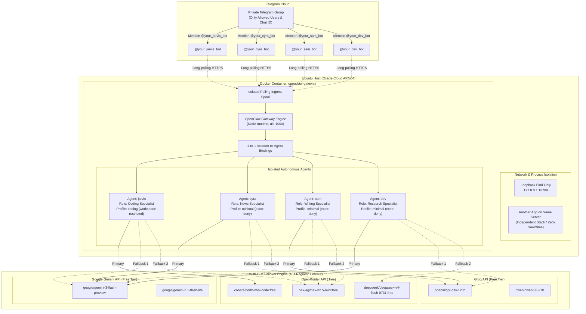

# System Architecture & Component Design

This document details the multi-agent routing topology, runtime isolation, and model failover architecture of the OpenClaw deployment on an ARM64 Linux server.

---

## 1. High-Level Architecture Diagram

---

## 2. Core Components

### 2.1 Telegram Polling Ingress
- OpenClaw utilizes **long-polling** over outbound HTTPS (`api.telegram.org`) rather than incoming webhooks.
- **Why long-polling?** Long-polling eliminates the need to expose ports publicly, assign public domain names, or manage inbound SSL certificates. The server port stays locked strictly to `127.0.0.1`.
- Each bot account maintains its own isolated polling spool directory inside `/home/node/.openclaw/telegram/ingress-spool-<agent>`, ensuring one slow bot never blocks another.

### 2.2 Discrete Agent Workspaces
Each agent operates with its own distinct workspace directory:
- `jarvis`: `~/.openclaw/workspace`
- `cyra`: `~/.openclaw/workspaces/cyra`
- `sam`: `~/.openclaw/workspaces/sam`
- `dev`: `~/.openclaw/workspaces/dev`

Each workspace holds persona files:
- `SOUL.md`: High-level directives, tone of voice, and behavioural guardrails.
- `IDENTITY.md`: Name, role, and self-conception.
- `AGENTS.md`: Operating boundaries and interaction rules.

### 2.3 Least-Privilege Tool Policies
OpenClaw enforces sandboxed permissions on a per-agent basis:
1. **Coding Agent (`jarvis`)**:
   - `profile: "coding"`
   - `fs.workspaceOnly: true` (Can only inspect/modify files inside its designated workspace directory).
   - `exec.applyPatch.workspaceOnly: true` (Diff patch application restricted to workspace).
2. **Minimal Agents (`cyra`, `sam`, `dev`)**:
   - `profile: "minimal"`
   - `alsoAllow: ["read", "write", "edit", "web_search", "web_fetch"]`
   - `deny: ["exec", "process", "terminal", "apply_patch"]`
   - `exec.mode: "deny"` (Cannot spawn shells, execute binary code, or call host processes).
   - Key-free search enabled via built-in DuckDuckGo integration.

### 2.4 Multi-Provider Failover Matrix
Every agent is assigned a primary model and a priority chain of secondary models. If an upstream provider returns HTTP 429 (rate limit exceeded), 503 (service unavailable), or fails within 45 seconds, the runtime automatically invokes the next fallback candidate.
